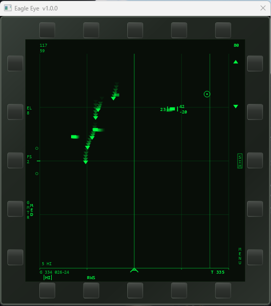
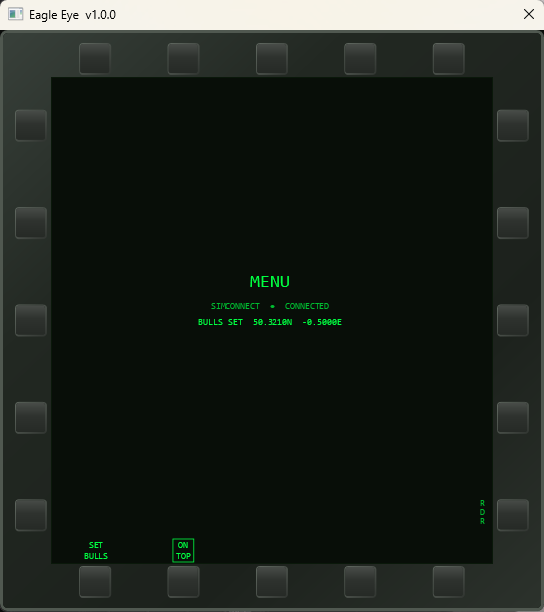

# Eagle Eye

**Airborne Intercept Radar Simulation for Microsoft Flight Simulator**

Eagle Eye is a Windows companion application for Microsoft Flight Simulator (MSFS) that renders a B-scope radar Multi-Function Display for use during virtual aviation tactical intercept operations. It connects to MSFS via SimConnect and provides radar situational awareness that is not natively available in the simulator.

The radar simulation is loosely based on open-source community analysis of the AN/APG-63 airborne intercept radar.

---

## Features

- **Three radar modes** — RWS (Range While Search), TWS (Track While Scan), and STT (Single Target Track)
- **Authentic B-scope MFD** — phosphor green display with metal bezel and OSB button interface
- **Probabilistic detection model** — range, aspect angle, and RCS-dependent detection, loosely based on AN/APG-63 open-source analysis
- **Flexible scan geometry** — 1/2/4/6/8-bar patterns, ±30°/±60° azimuth, ±60° antenna elevation
- **GMTR** — Ground Moving Target Rejection with LO / MED / HI / CHAF threshold settings
- **TWS track management** — tentative, confirmed, and coasting tracks with SPT/PDT designation
- **Bullseye reference** — set a geographic reference point for bearing/range position calls
- **OSB menu system** — full configuration via on-screen buttons; no dropdown menus
- **Auto-update** — checks GitHub Releases on startup and prompts if a newer version is available

---

## Requirements

| Component | Requirement |
|-----------|-------------|
| OS | Windows 10 or Windows 11 (64-bit) |
| Simulator | Microsoft Flight Simulator 2020 or 2024 |
| Runtime | .NET 8.0 (included with Windows 11; [download for Windows 10](https://dotnet.microsoft.com/download)) |
| Display | Minimum 1280×720; Eagle Eye window is fixed 560×620 px |

---

## Installation

1. Download the latest release ZIP from the [Releases](../../releases) page.
2. Extract to a permanent location (e.g. `C:\Program Files\EagleEye\`).
3. Launch **EagleEye.App.exe** — no installer required.
4. Start MSFS before or after launching Eagle Eye. It will connect to SimConnect automatically and retry until the simulator is detected.

> **SimConnect DLLs** (`SimConnect.dll` and `Microsoft.FlightSimulator.SimConnect.dll`) are included in the release ZIP and must remain in the same folder as the executable.

---

## Quick Start

| Action | Method |
|--------|--------|
| Range up / down | **PB15** (▲) / **PB14** (▼) or keys **R** / **F** |
| Cycle bar pattern | **PB2** or key **B** |
| Toggle RWS ↔ TWS | **PB7** or key **M** |
| Designate STT | Left-click a contact |
| Break STT lock | **PB7**, right-click, or **Backspace** |
| Cycle GMTR | **PB4** or key **G** |
| Antenna tilt | Keys **Q** (up) / **A** (down) |
| Open MENU | **PB11** |
| Set Bullseye | **PB11** → **PB6 SET BULLS** |

A full keyboard and button reference is included in the [User Manual](docs/EagleEye_UserManual_v1.0.0.docx).

---

## Known Limitations

- **VATSIM** — contact visibility is limited by your pilot client's range setting. vPilot's maximum is 100 nm (configurable in Settings > Performance).
- **JoinFS** — contact range is bounded by the Circle of Activity radius set in JoinFS Settings.
- **IFF / identification** — all contacts display as Unknown. IFF discrimination is planned for a future release.
- **RCS** — all contacts use a fixed 5 m² default. Per-type RCS simulation is planned for a future release.

---

## Documentation

The full User Manual is included in the release ZIP and covers installation, all radar modes, symbology, display annunciators, bullseye, MENU page operation, keyboard reference, detection model, and known limitations.

---

## Roadmap

| Version | Planned Content |
|---------|----------------|
| v1.x | TWS symbology review, selectable Frame Store |
| v2.0 | Networking (P2P/relay), IFF/HAFU, scenario files |
| v3.0 | MIDS datalink simulation, AWACS/GCI display variant |

---

## Disclaimer

Eagle Eye is a simulation tool for virtual aviation recreation only. The radar simulation is loosely based on open-source and publicly available reference material. It is not a certified or accurate simulation of any real system and must not be used for any purpose other than virtual aviation recreation.

---

## Support Development

Eagle Eye is free and developed in personal time. If you find it useful and want to support continued development, a donation via Ko-fi is greatly appreciated — it helps cover time and any associated costs.

---

## Licence

See [LICENCE](LICENCE) for terms.
